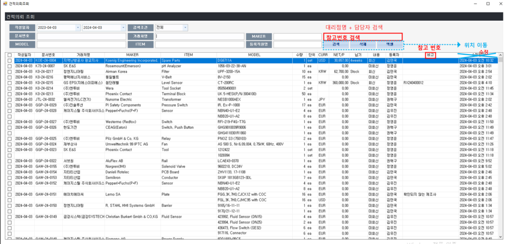
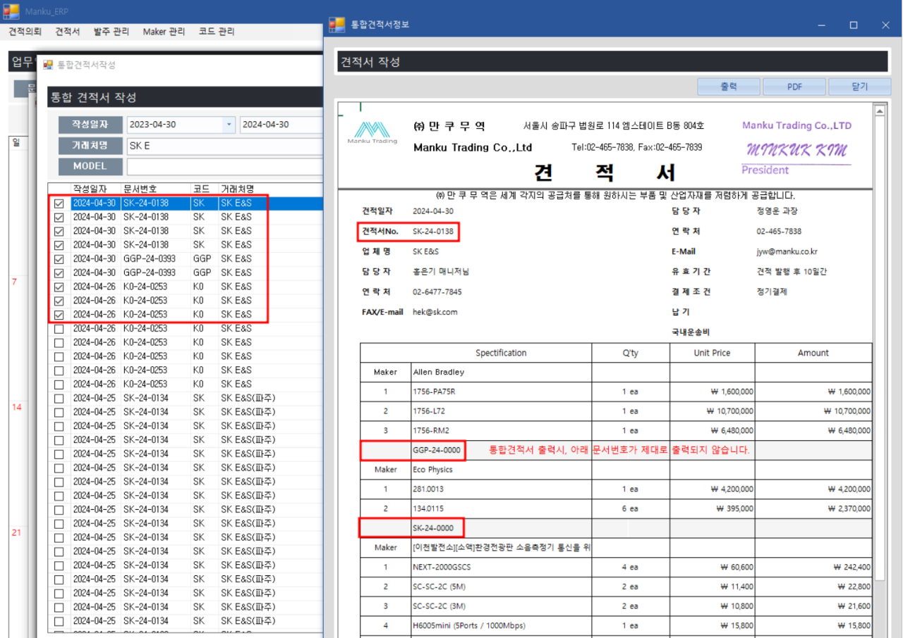
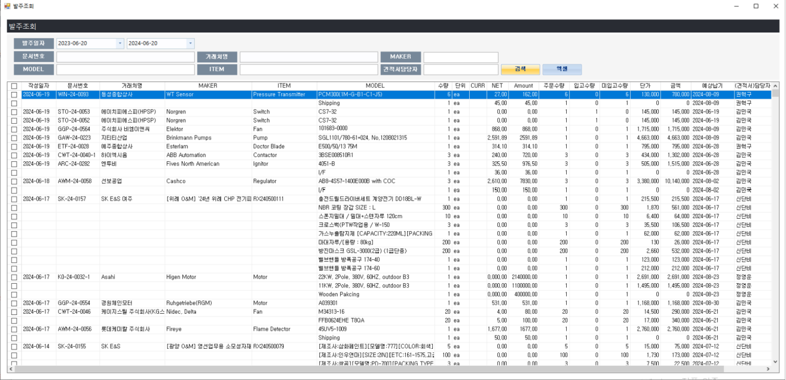
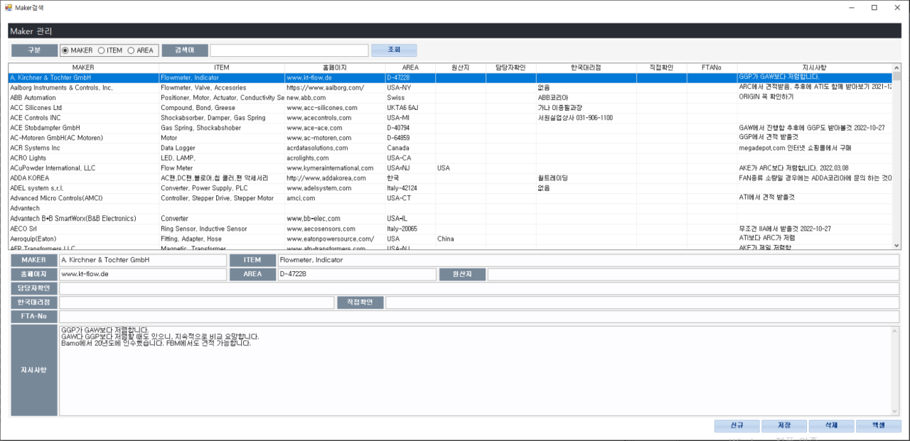
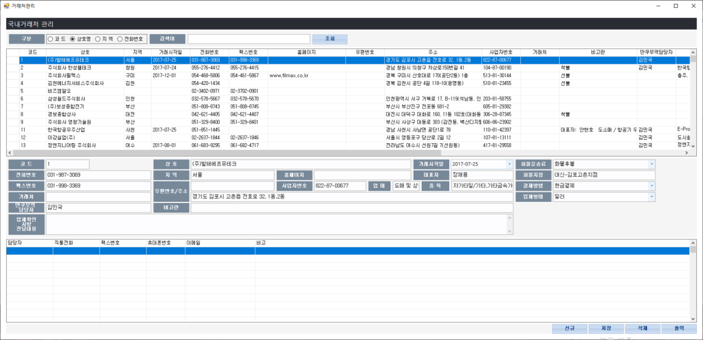

# Manku ERP 제안서

## 현재 ERP SiteMap

1. 견적의뢰
    - 의뢰작성
    - 의뢰조회
    - 메일전송  
      

2. 견적서
    - 견적서 작성
    - 견적서 조회
    - 통합견적서 작성   
     

3. 발주관리
    - 발주서 작성
    - 발주 조회
    - 재고관리
    - 정산관리   
     

4. Maker관리
    - 메이커 관리
    - 메이커 검색    
     
    
5. 코드관리
    - 국내 대리점(매입)
    - 국외 대리점
    - 국내 거래처
    - 국외 거래처
    - 공문서
    - ERP 계정관리
    - 사용자 계정관리
    - 환율조회
    - HS-Code 조회     
     

#### `요청사항 및 현재 가지고있는 기능들`  

1. 메일전송 시 마이크로소프트 아웃룩과 연동하여 자동으로 메일을 발송
2. 메일 회신후 확인된 메일은 당사 ERP 코드와 연동하여 기록가능  
3. 견적의뢰, 견적서, 발주서 파일을 PDF 파일로 생성
4. 아마존드라이브 이용하여 자료 정리 가능할지 간단히
5. 기타 자동화 기능 등(지금 손이 너무 많이 갑니다.)
6. etc.  

---

## `Manku ERP System Development Plan`

간략하게 설명한 기존 사이트맵이 포함된 새로운 ERP(Enterprise Resource Planning) 프로그램을 개발하려면 계획부터 배포까지 여러 단계가 필요합니다. 
이 프로젝트를 시작하기 위한 구조화된 접근 방식은 다음과 같습니다.

1. `요구사항 수집 및 분석`  
- `비즈니스 프로세스 이해:` 사이트맵(예: 설계의뢰, 설계서, 발주관리 등)에 설명된 대로 ERP가 지원해야 하는 비즈니스 프로세스를 깊이 이해합니다.
- `기능 요구 사항 식별:` 사이트맵을 기반으로 각 모듈의 기능 요구 사항을 식별합니다. 예를 들어, 메일전송의 경우 이메일을 보내려면 Microsoft Outlook과 통합해야 합니다.

2. `시스템 설계`  
- `아키텍처 설계:` ERP 시스템에 적합한 아키텍처를 결정합니다. 마이크로서비스 아키텍처는 확장성과 유연성을 제공할 수 있는 반면, 모놀리식 아키텍처는 초기 개발이 더 간단할 수 있습니다.
- `데이터베이스 설계:` 설계서, 발주서, 메이커 관리 등과 같은 엔터티를 고려하여 모든 데이터 요구 사항을 지원하는 데이터베이스 스키마를 설계합니다.
- `UI/UX 디자인:` 최종 사용자를 위한 유용성과 효율성에 중점을 두고 사용자 인터페이스와 경험을 디자인합니다.

3. `기술 스택 선택`  
- `백엔드:` 아키텍처 및 기능 요구 사항을 지원하는 백엔드 기술(예: Node.js, .NET, Java)을 선택합니다.
- `프런트엔드:` 사용자 인터페이스 구축을 위한 프런트엔드 프레임워크 또는 라이브러리(예: React, Angular, Vue.js)를 선택합니다.
- `데이터베이스:` 데이터 스토리지 요구 사항에 맞는 데이터베이스(예: MySQL, PostgreSQL, MongoDB, Oracle)를 결정합니다.
통합 도구: 이메일 전송이나 Amazon Drive와의 통합과 같은 기능을 위해 적절한 API 또는 SDK를 조사하고 선택하세요.

4. `개발`  
- `모듈형 개발:` 견적의뢰, 발주관리 등 핵심 기능부터 시작하여 모듈별로 시스템 모듈을 개발합니다.
- `API 개발:` 각 기능에 대한 API를 개발하여 보안과 확장성을 보장합니다.
- `프런트엔드 개발:` 디자인을 기반으로 UI를 구현하여 API를 통해 백엔드와 올바르게 상호 작용하는지 확인합니다.

5. `테스트`  
- `단위 테스트:` 개별 구성요소 또는 기능에 대한 단위 테스트를 작성하여 예상대로 작동하는지 확인합니다.
- `통합 테스트:` 다양한 모듈과 외부 서비스(예: Microsoft Outlook, Amazon Drive) 간의 통합을 테스트합니다.
- `UAT(사용자 승인 테스트):` 최종 사용자가 시스템을 테스트하여 시스템이 자신의 요구 사항을 충족하고 사용자 친화적인지 확인하도록 합니다.

6. `배포 및 유지 관리`  
- `배포:` ERP 시스템을 프로덕션 환경에 배포합니다. 확장성과 유연성을 위해 클라우드 플랫폼을 고려하세요.
- `유지 관리:` 시스템에 문제가 있는지 지속적으로 모니터링하고 향후 개선을 위해 사용자 피드백을 수집합니다.

7. `교육 및 문서화`  
- `사용자 교육:` 최종 사용자가 새로운 ERP 시스템을 효과적으로 사용할 수 있도록 교육을 제공합니다.
- `문서:` 나중에 참조할 수 있도록 사용자와 개발자 모두를 위한 포괄적인 문서를 만듭니다.

**자동화 및 통합을 위한 제안**
- `이메일 통합`: 
    - Microsoft Graph API를 사용하여 Microsoft Outlook과 통합하여 이메일을 보내고 추적할 수 있도록 개발 합니다.
    - PDF 생성: 수정의뢰, 견적서, 발주서 파일에서 PDF를 생성하려면 iText(Java)(가격이 비쌉니다.) 또는 ReportLab(Python)과 같은 라이브러리등을 고려 하여 개발합니다. - 가능하면 오픈소스로 가는걸 추천 합니다.

- `클라우드 스토리지`: 
    - Amazon Drive 또는 유사한 서비스와 통합하여 해당 API를 사용하여 파일 스토리지 및 구성을 자동화 하여 개발합니다.

- `자동화 도구`: 
    - 반복 작업을 자동화하고 수동 작업 부하를 줄일 수 있도록 개발합니다.

ERP 시스템 개발은 신중한 계획, 숙련된 개발, 지속적인 피드백이 필요한 복잡하고 시간이 많이 걸리는 프로세스입니다. 
작게 시작하여 먼저 핵심 기능에 집중하고, 사용자 피드백과 비즈니스 요구 사항을 기반으로 시스템을 점차 확장해 가야 합니다.

## `개발 로드맵`

- [백앤드](#백앤드)
- [프론트앤드](#프론트앤드)

### `백앤드`

`I. API : JavaPlatform`
Java를 사용하여 ERP(Enterprise Resource Planning) API 시스템을 개발하기 위해 Spring Framework는 엔터프라이즈 애플리케이션에 이상적인 포괄적인 프로그래밍 및 구성 모델을 제공합니다.   
다음은 ERP API 구축에 특히 유용한 Spring Framework의 몇 가지 주요 구성 요소입니다.   
저희는 이증 JPA 기반으로 개발을 하겠습니다.

- `스프링 부트`
    - `기능`:   
    구성보다 규칙을 통해 새로운 Spring 애플리케이션 개발을 단순화합니다. 배포와 테스트를 쉽게 하기 위해 임베디드 서버를 제공합니다.
    - `이점`:   
    최소한의 구성으로 ERP API를 신속하게 개발하고 배포합니다. 이는 모듈식 ERP 시스템에 도움이 될 수 있는 마이크로서비스 아키텍처에 이상적입니다.

- `스프링 데이터 JPA`
    - `기능`:   
    JPA(Java Persistence API) 위에 레이어를 제공하여 데이터베이스 작업을 더 쉽게 수행할 수 있습니다.
    - `이점`:   
    ERP 시스템의 데이터 액세스 작업을 단순화하여 상용구 코드를 줄이고 코드 가독성을 향상시킵니다. 광범위한 데이터베이스를 지원하므로 다양한 ERP 요구 사항에 유연하게 대응할 수 있습니다.

- `스프링 시큐리티`
    - `기능`:   
    인증 및 승인을 위한 포괄적인 보안 기능을 제공합니다.
    - `이점`:  
    ERP API 엔드포인트가 안전하고 승인된 사용자만 액세스할 수 있도록 보장합니다. ERP 시스템의 특정 보안 요구 사항을 충족하도록 고도로 맞춤화할 수 있습니다.

`II. DataBase : MySQL`
- `기능`:    
널리 사용되는 오픈 소스이며 저장 프로시저, 트리거 및 보기를 지원합니다.
- `장점`:   
사용하기 쉽고 호스팅 서비스에서 널리 지원되며 대규모 커뮤니티가 있습니다.

### `프론트앤드`

`I. Electron`

[Electron](https://www.electronjs.org/)은 개발자가 HTML, CSS, JavaScript와 같은 웹 기술을 사용하여 크로스 플랫폼 데스크톱 애플리케이션을 구축할 수 있는 프레임워크입니다.   
각 플랫폼의 코드베이스를 변경할 필요 없이 여러 운영 체제(Windows, macOS, Linux)에서 설치 후 실행되는 단일 애플리케이션을 개발할 수 있으므로 ERP(Enterprise Resource Planning) 프로그램을 만드는 데 특히 유용합니다. 이를 통해 모든 플랫폼에서 일관된 사용자 경험을 제공하는 동시에 개발 및 유지 관리 비용을 크게 줄일 수 있습니다.

**`Electron이 ERP 개발 계획에 어떻게 적용되는지`**

- `교차 플랫폼 지원 (Cross-Platform Support)`:   
ERP 프로그램에 대한 Electron의 주요 장점은 여러 운영 체제에서 실행할 수 있다는 것입니다. 이렇게 하면 사용자가 선호하는 OS에 관계없이 ERP 애플리케이션에 액세스할 수 있습니다.

- `웹 기술 (Web Technologies)`:   
Electron 애플리케이션은 웹 기술로 구축되므로 빠른 개발이 가능하고 웹 기반 서비스 및 API와 쉽게 통합할 수 있습니다. 이는 이메일(Microsoft Outlook), 클라우드 스토리지(Amazon Drive) 등과 같은 다양한 서비스와의 통합이 필요한 ERP 시스템에 특히 유용합니다.

- `풍부한 사용자 인터페이스 (Rich User Interface)`:   
Electron은 최신 웹 기술을 지원하므로 매력적이고 기능적인 풍부하고 대화형 사용자 인터페이스(UI)를 만들 수 있습니다. 이는 사용자 경험이 생산성에 큰 영향을 미칠 수 있는 ERP 시스템에 매우 중요합니다.

- `통합 기능 (Integration Capabilities)`:   
Electron은 Node.js 모듈 및 API를 통해 기본 OS 기능 및 타사 서비스와 쉽게 통합할 수 있습니다. 이를 통해 ERP 애플리케이션에서 직접 이메일 보내기, PDF 생성, 클라우드 서비스와의 상호 작용 등의 기능을 더 쉽게 구현할 수 있습니다.

- `성능 고려 사항 (Performance Considerations)`:   
Electron은 많은 이점을 제공하지만 Electron 앱은 기본 애플리케이션보다 리소스 집약적일 수 있다는 점을 고려하는 것이 중요합니다. 그러나 많은 ERP 애플리케이션의 경우 플랫폼 간 호환성과 개발 효율성을 절충하는 것은 그만한 가치가 있습니다.

- `보안 (Security)`:    
보안은 ERP 시스템의 중요한 측면입니다. Electron은 일반적인 취약점으로부터 애플리케이션을 보호하는 데 도움이 되는 보안 기능과 모범 사례를 제공합니다. 데이터와 사용자 정보를 보호하려면 이러한 관행을 성실히 따르는 것이 중요합니다.

**`사례`**
- `모듈형 개발`:    
단일 Electron 애플리케이션 내에서 ERP 시스템을 일련의 모듈(예: 견적의뢰, 발주관리)로 개발할 수 있습니다. 이 모듈식 접근 방식은 Electron의 기능과 잘 어울리며 ERP 시스템의 다양한 부분을 더 쉽게 관리하고 업데이트할 수 있습니다.

- `API 개발 및 통합`:    
메일전송과 같은 기능의 경우 Electron 내의 Node.js 모듈을 사용하여 Microsoft Graph API를 통해 Microsoft Outlook과 같은 이메일 서비스와 통합할 수 있습니다. 마찬가지로 PDF 생성 및 클라우드 스토리지 통합의 경우 적절한 Node.js 패키지 및 API를 사용할 수 있습니다.

- `샘플`
    > [showcase](https://www.electronjs.org/apps)  
    
Electron은 웹 기술의 유연성과 데스크톱 애플리케이션의 기능을 결합하여 ERP 프로그램 개발을 위한 강력한 플랫폼을 제공합니다. 계획에 설명된 대로 현대적이고 효율적인 크로스 플랫폼 ERP 시스템을 만드는 데 적합한 선택입니다.   
샘플 쇼케이스를 보시면 흔히 알고계시는 많은 서비스프로그램이 Electron 으로 개발되었다는 것을 알 수 있습니다.

`II. Next.js`

ERP 개발을 위해 Electron과 함께 Next.js를 사용하면 두 프레임워크의 장점이 결합되어 현대적이고 효율적인 크로스 플랫폼 ERP 시스템을 구축하기 위한 강력한 솔루션을 제공합니다. 이 조합의 이점은 다음과 같습니다.

**ERP 개발을 위해 Electron과 함께 Next.js를 사용하는 이점**
- `Next.js를 사용한 서버 측 렌더링(SSR)`:   
Next.js는 서버 측 렌더링에 탁월하여 ERP 애플리케이션의 초기 로드 시간을 크게 향상시킬 수 있습니다. 이는 콘텐츠를 더 빠르게 표시하여 사용자 경험을 향상시킬 수 있으므로 대규모 데이터 세트가 있는 복잡한 애플리케이션에 특히 유용합니다.

- `정적 사이트 생성(SSG)`:   
Next.js는 정적 사이트 생성도 지원하므로 빌드 시 페이지를 사전 렌더링할 수 있습니다. SEO가 ERP 시스템의 주요 관심사가 아닐지라도 이는 성능과 SEO를 향상시킬 수 있습니다.

- `풍부한 사용자 인터페이스 및 UX`:    
React 프레임워크인 Next.js를 사용하면 풍부하고 대화형 사용자 인터페이스를 쉽게 구축할 수 있습니다. 이를 통해 더욱 매력적이고 사용자 친화적인 ERP 애플리케이션을 만들 수 있습니다.

- `Electron을 사용한 크로스 플랫폼 데스크톱 애플리케이션`:    
Electron을 사용하면 Next.js 애플리케이션이 여러 운영 체제에서 데스크톱 애플리케이션으로 실행될 수 있습니다. 이는 Windows, macOS 및 Linux에서 네이티브와 유사한 경험을 계속 제공하면서 Next.js의 개발 효율성과 UI 기능을 활용할 수 있음을 의미합니다.

- `API 및 마이크로서비스와의 손쉬운 통합`:    
Next.js와 Electron 모두 외부 API 및 마이크로서비스와의 손쉬운 통합을 지원합니다. 이는 이메일 전송, PDF 생성, 클라우드 저장과 같은 기능을 위해 다양한 서비스와 통신해야 하는 ERP 시스템에 매우 중요합니다.

- `개발 효율성`:    
Next.js와 Electron을 결합하면 ERP 시스템의 웹 버전과 데스크톱 버전 모두에 대해 단일 코드베이스를 유지할 수 있습니다. 이를 통해 개발 및 유지 관리 노력을 크게 줄일 수 있습니다.

- `개발 경험과 노하우`:   
저희는 30년차 이상의 백앤드 개발자, 프론트앤드 개발자, UX/UI 디자이너, 기획자 등이 있습니다. 이 분야 개발에 충분한 경험과 노하우가 있습니다.

**구현 예**
> Next.js가 프런트엔드 및 서버측 로직을 처리하고 서버에서 또는 정적으로 페이지를 렌더링하는 ERP 시스템을 설정할 수 있습니다. 그런 다음 Electron은 이 Next.js 애플리케이션을 래핑하여 데스크탑 인터페이스를 제공하고 파일 시스템, 알림 등과 같은 기본 기능에 대한 액세스를 제공합니다.

> 이 접근 방식을 사용하면 최고의 웹 개발(Next.js를 통해) 및 데스크톱 애플리케이션 개발(Electron을 통해)을 활용하여 계획에 설명된 대로 강력하고 효율적인 크로스 플랫폼 ERP 시스템을 만들 수 있습니다.

---  
  

## `Manku ERP System Develepment Project 제안사항`

본 프로젝트는 견적의뢰, 견적서, 발주관리, 메이커관리, 코드관리 등을 포함하는 ERP 시스템 개발을 목표로 합니다. 시스템은 Electron, Next.js, Java JPA, MySQL을 사용하여 개발되며, 다음과 같은 주요 기능을 포함합니다.

### 주요기능

- [견적의뢰관리](#견적의뢰관리)
- [견적서관리](#견적서관리)
- [발주서관리](#발주서관리)
- [메이커관리](#메이커관리)
- [협력업체관리](#협력업체관리)
- [코드관리](#코드관리)
- [직원관리](#직원관리)

### `견적의뢰관리`
- 의뢰 작성 :      
한번 작성된 견적 의뢰는 DB에 목록화되어 저장 되도록 하고, 저장시에는 담당자 배정과 견적의뢰 작성 시간을 저장해 타임라인 관리가 되도록 개발합니다.
- 의뢰 조회 :   
한번 작성된 견적의뢰는 검색폼에 의해 담당자, 고객, 작성시간등을 상세히 검색 할 수 있도록 개발 합니다.
- 마이크로소프트 아웃룩과 연동하여 자동 메일 전송 :   
가장 불편하게 생각 하셨던 부분입니다. 이는 Microsoft Graph API를 통해 Microsoft Outlook과 같은 이메일 서비스와 통합하여 메일발송한 기록을 견적의뢰업체, 담당자, 시간등 히스토리화 하여 관리 할 수 있도록 개발합니다.

### `견적서관리`  
- 견적서 작성:   
견적에 필요한 데이터를 정의하고 견적서의 항목, 가격, 수량, 고객정보등 최초 입력된 정보를 DB화 하여 최종 결과물까지 활용 할 수 있도록 설계 개발합니다.    
- 견적서 조회:
- 통합견적서 작성:
- 견적서 PDF 생성:   
발송 및 받은 견적서를 DB에 저장하고 파일은 아마존 S3에 저장 할 수 있도록 합니다.
아마존 S3의 저장 공간은 무한대 이고 입출력시 트래픽 과금만 됩니다.   

### `발주서관리`
- 발주서 작성
- 발주 조회
- 재고 관리
- 정산 관리   

> 발주서 관리 시스템은 기업이 물품이나 서비스를 구매할 때 사용하는 발주서를 효율적으로 관리하기 위함입니다. 
> 이 시스템을 통하여 발주서 생성, 승인, 추적, 보고 등의 과정을 자동화하고, 구매 관련 데이터를 중앙에서 관리할 수 있도록 개발합니다. 

### `메이커관리`
- 메이커 관리
- 메이커 검색

### `협력업체관리`

### `코드관리`
- 카테고리관리
    - 제품관리 : 메이커와 연동
- 국내 대리점(매입)
- 국외 대리점
- 국내 거래처
- 국외 거래처
- 공문서
- 환율 조회
- HS-Code 조회

### `기본관리`
- 관리자설정
    - 비밀번호설정
    - 관리자설정 : 메뉴별 직원접속권한 설정등
    - 로그인기록설정 : 직원 및 서브관리자 접속정보
- ERP 계정 관리
- 사용자 계정 관리
    - 직원관리
    - 직원별 진행업무 목록 확인

### `통계`
    - 제품수, 견적의뢰수, 발주수, 판매금액, 수술등

### `요청사항`
1. 메일 전송
    - 마이크로소프트 아웃룩과 연동하여 메일 자동 발송 기능을 구현합니다.
    - 메일 회신 시 ERP 코드와 연동하여 기록합니다.

2. 문서 관리
    - 견적의뢰, 견적서, 발주서 파일을 PDF 파일로 생성 하는 기능을 제공합니다.

3. 자료 정리
    - 아마존 드라이브와 연동하여 자료 정리가 가능한 기능을 도입합니다.

4. 기타 자동화 기능
    - 다양한 자동화 기능을 추가하여 작업의 효율성을 극대화합니다.

### `개발 스택`
1. Electron
    - 데스크톱 애플리케이션 개발을 위한 프레임워크로, 크로스 플랫폼 지원.

2. Next.js
    - 서버사이드 렌더링 및 정적 웹사이트 생성이 가능한 React 프레임워크로, SEO 최적화와 빠른 로딩 속도를 제공합니다.

3. Java JPA
    - Java Persistence API를 사용하여 데이터베이스와의 매핑을 효율적으로 관리합니다.

4. MySQL
    - 데이터의 저장과 관리를 위해 안정적이고 확장 가능한 MySQL 데이터베이스를 사용합니다.

### `개발 일정`

1. 요구사항 분석 및 설계 (1개월)
- 요구사항 분석
- 시스템 아키텍처 설계
- 데이터베이스 설계

2. 기본 기능 개발 (3개월)
- 견적의뢰 관리
- 견적서 관리
- 발주관리

3. 고급 기능 개발 (2개월)
- 메일 연동 기능
- PDF 생성 기능
- 아마존 드라이브 연동

4. 테스트 및 디버깅 (1개월)
- 단위 테스트
- 통합 테스트
- 사용자 테스트

5. 배포 및 유지보수 (1개월)
- 시스템 배포
- 초기 유지보수 및 지원

### `개발 팀 구성`

1. 프로젝트 매니저
> 프로젝트 전반을 관리하며, 일정과 예산을 조정합니다.

2. 프론트엔드 개발자
> Electron 및 Next.js를 사용하여 사용자 인터페이스를 개발합니다.

3. 백엔드 개발자
> Java JPA와 MySQL을 사용하여 서버 로직과 데이터베이스를 구축합니다.

4. QA 엔지니어
> 시스템의 품질을 보장하기 위해 테스트 계획을 수립하고 실행합니다.

### `비용 견적`

| 구분 | 금액 |
|:-------------:|:---------------:|
| 요구사항 분석 및 설계 | 1,000만원 |
| 기본 기능 개발 | 3,000만원 |
| 고급 기능 개발 | 2,000만원 |
| 테스트 및 디버깅 | 1,000만원 |
| 배포 및 유지보수 | 1,000만원 |
| **총 개발 비용** | **8,000만원** |

#### `총 3카피 개발시`
> 업체당 3,000만원에 개발 가능 합니다.

### `결론`

본 ERP 시스템은 다양한 기능을 통해 업무 효율성을 극대화할 수 있도록 설계합니다.  
자동화 기능과 문서 관리 기능을 통해 사용자의 작업 부담을 줄이고, 아웃룩 및 아마존 드라이브 연동을 통해 데이터 관리의 편의성을 제공합니다.
본 시스템 개발이 귀사의 인력에 대한 비용을 최소화 할 수 있을것이라 예상 합니다.

저희 팀은 경험과 전문성을 바탕으로 최상의 ERP 시스템을 제공할 것을 약속드립니다.  
감사합니다.
